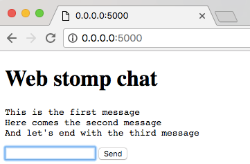

### About
To run this project you need a dedicated plan with [CloudAMQP] (https://www.cloudamqp.com). Set your `ENV` variable `CLOUDAMQP_URL` to the URL given in the CloudAMQP Console.

When everything works you'll be able to see a chat window like this:

### Run
Run with `foreman start`
